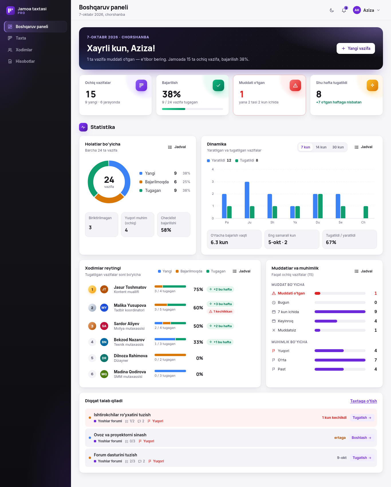

# Jamoa taxtasi Pro

**Bosqich:** tuman · **Ishtirokchi kodi:** KOD · **Bilet:** 010 — “Vazifalar taxtasi” · **Yo‘nalish:** jamoa va ishni tashkil etish
**Repo:** https://github.com/AdilxanKenesov/Team-Board

Jamoa vazifalarini boshqarish tizimi. **Administrator** vazifa yaratadi va xodimga biriktiradi; **xodim** faqat o‘ziga berilgan vazifalarni ko‘radi va ularni **Yangi → Bajarilmoqda → Tugagan** bo‘ylab o‘tkazadi. Har bir o‘zgarish saqlanadi, bildirishnoma keladi va statistikada ko‘rinadi.

## Ishga tushirish
1. `index.html` ni **Chrome** yoki **Edge** brauzerida oching (ikki marta bosish yetarli).
2. Internet, server yoki o‘rnatish kerak emas — sayt `file://` dan to‘liq ishlaydi.
3. Birinchi ochilishda **“Demo bilan tanishish”** ni bosing: 7 kishilik sun’iy jamoa, 3 loyiha, 24 vazifa yuklanadi.
4. Kirish sahifasidagi **demo hisob** tugmalaridan birini bosing — parol kiritish shart emas:
   - **Aziza Karimova** — administrator;
   - **Malika, Jasur, Bekzod** — xodimlar.
5. Yoki **“tizimni noldan sozlang”** orqali o‘z administrator hisobingizni yarating.

## Biletning majburiy imkoniyatlari
| # | Talab | Yechim | Sinov | Natija |
|---|---|---|---|---|
| 1 | Vazifa nomini qo‘shish | Admin: **“Yangi vazifa”** formasi (nom 2–120 belgi, label, xato xabari) yoki ustundagi **tez qo‘shish** (Enter) | e2e: “vazifa yaratish → xodimga bildirishnoma”, “noto‘g‘ri kiritishlar” | ✅ |
| 2 | **Yangi**, **Bajarilmoqda**, **Tugagan** ustunlari | Kanban taxta, har ustunda vazifalar soni; telefonda tablar | e2e: “taxta…”, “telefon 390px…” | ✅ |
| 3 | Holatni tugmalar orqali almashtirish | Kartada **Boshlash →**, **Tugatish →**, **← Qaytarish**; vazifa oynasida holat tugmalari; sichqoncha bilan sudrash | e2e: “taxta: Boshlash…”, “xodim vazifani boshlaydi” | ✅ |
| 4 | Son va vazifalar saqlansin | `localStorage` (`tbpro.db.v1`); sahifa yangilanganda vazifa, holat, sessiya va til joyida | e2e: “sahifani yangilash…” | ✅ |
| Sinov | Yangi → Bajarilmoqda: **Yangi −1**, **Bajarilmoqda +1** | “Boshlash” bosilganda ikkala son darhol yangilanadi; “Bekor qilish” qaytaradi | e2e: “taxta: Boshlash → Yangi −1, Bajarilmoqda +1; bekor qilish” | ✅ |

## Qo‘shimcha imkoniyatlar
- **Ikki rol va kirish.**
  - Administrator: boshqaruv paneli, taxta, xodimlar, hisobotlar.
  - Xodim: “Mening kunim”, “Mening taxtam”, bildirishnomalar.
  - Xodim vazifa yarata olmaydi va boshqa xodim vazifasini ocholmaydi (interfeys va ma’lumotlar qatlami darajasida).
- **Xavfsizlik (namoyish darajasi).**
  - Parollar tuz bilan SHA-256 (500 marta) xeshlanadi, ochiq parol saqlanmaydi.
  - 5 marta xato kiritilganda kirish 30 soniyaga bloklanadi.
  - Sessiya muddati: 12 soat yoki “meni eslab qol” bilan 30 kun.
  - Admin parolni tiklasa, xodim birinchi kirishda uni almashtiradi.
- **Vazifa.** Loyiha, mas’ul, muhimlik, muddat (o‘z kalendari), teglar, checklist, izohlar, o‘zgarishlar tarixi; har amaldan keyin 6 soniya “Bekor qilish”.
- **Bildirishnomalar.**
  - Vazifa biriktirilganda, izoh yozilganda, holat o‘zgarganda.
  - Muddati yaqinlashganda va o‘tganda (kuniga bir marta).
- **Boshqaruv paneli — statistika.**
  - 4 ta KPI.
  - Holatlar donuti.
  - 7/14/30 kunlik dinamika.
  - Xodimlar reytingi.
  - Muddat va muhimlik bo‘yicha taqsimot.
  - Har grafikda tooltip va “Jadval” ko‘rinishi.
  - Ranglar rang ajrata olmaydiganlar uchun tekshirilgan.
- **Hisobot.**
  - Davr, loyiha va xodim bo‘yicha filtr.
  - **Yuklab olish ▾** menyusi: **Matn (.txt)**, **CSV** (Excel) va **PDF** (A4).
  - Namuna: `dalillar/13-hisobot-namuna.pdf`.
- **Til va mavzu.**
  - O‘zbekcha / Русский, yorug‘ / tungi rejim.
  - Sozlama qurilma bo‘yicha umumiy: kirish sahifasi, admin va xodim uchun bir xil.
- **Moslashuv.**
  - 390 / 768 / 1366 px; telefonda pastki menyu va tablar.
  - Klaviatura: `N` yangi vazifa, `G B` taxta, `?` yorliqlar, `Esc` yopish.
  - “Harakatni kamaytirish” rejimida animatsiyalar o‘chadi.

## Noto‘g‘ri kiritish sinovlari
| Holat | Natija |
|---|---|
| Bo‘sh nom yoki faqat bo‘sh joy | “Vazifa nomini yozing.” — vazifa qo‘shilmaydi |
| 1 belgili nom | “Nom kamida 2 ta belgidan iborat bo‘lsin.” |
| Chegaradan oshish (121+ belgi) | “Nom 120 ta belgidan oshmasin.” |
| Shu loyihada bir xil nom | “Bu loyihada shunday nomli vazifa bor.” (`o'` / `o‘` / `oʻ` farqlanmaydi) |
| O‘tgan sana | Kalendarda o‘tgan kunlar yopiq; ma’lumotlar qatlami ham rad etadi: “Muddat bugundan oldin bo‘lmasin.” |
| Noto‘g‘ri sana (`2026-02-30`) | “Muddat noto‘g‘ri sana.” |
| 7 ta teg / 31 ta checklist bandi | “Ko‘pi bilan 6 ta teg.” / “Ko‘pi bilan 30 ta band.” |
| Bo‘sh izoh, 1000+ belgili izoh | Yuborilmaydi / “Izoh 1000 ta belgidan oshmasin.” |
| Noto‘g‘ri login yoki parol | “Login yoki parol noto‘g‘ri. Yana N ta urinish qoldi.”; 5-xatodan keyin 30 s blok |
| Ruxsatsiz holat o‘tishi (masalan, xodim Yangi → Tugagan) | Rad etiladi: “Bu o‘tish mumkin emas.”; xodim faqat ketma-ket o‘tkazadi |
| Sahifani yangilash | Vazifalar, holatlar, sessiya, til va mavzu saqlanadi |
| Buzilgan saqlangan ma’lumot | Yaroqsiz yozuvlar tashlanadi, ilova ishlashda davom etadi |
| 0, manfiy, kasr son | Sayt shaklida sonli maydon yo‘q — bu sinov mos emas |

## Testlar
Uchta to‘plam. Oxirgi ishga tushirish: **hammasi ✅, 0 xato**.

| To‘plam | Buyruq | Nima tekshiradi | Natija |
|---|---|---|---|
| Unit | `node tests/unit.js` | SHA-256 (ma’lum vektorlar), validatsiya, ruxsatlar, holat o‘tishlari, auth (blok, sessiya, demo kirish), ombor (buzilgan ma’lumot, import), statistika, bildirishnoma qoidalari, ruscha lug‘at to‘liqligi | 23 / 23 ✅ |
| Brauzer (e2e) | `python3 -m http.server 8020` + `node tests/e2e.mjs` | Haqiqiy Chrome’da to‘liq yo‘llar: demo → kirish → vazifa berish → xodim ko‘radi va boshlaydi; bilet sinovi; noto‘g‘ri kiritishlar; yangilash; til va mavzu; hisobot; sozlamalar; 390 px | 30 / 30 ✅ |
| Tugmalar auditi | `node tests/buttons.mjs` | 22 ta holatda har bir tugma va havola ishlaydimi (ishlovchi bor, marshrut mavjud) | ✅ |

Qo‘shimcha: `file://` orqali ochish (konsolda xato yo‘q, shriftlar yuklanadi), rus tilida barcha ekranlarni aylanib chiqish.

## Topilgan va tuzatilgan xatolar
| Xato | Tuzatish | Commit |
|---|---|---|
| “Asosiy qismga o‘tish” havolasi “Sahifa topilmadi” ochardi (`#view` hash-router bilan to‘qnashgan) | Bosilganda fokus asosiy qismga ko‘chadi | `237ac6b` |
| Menyuda ikonka cho‘zilib, matn ikki qatorga tushardi | Selektor faqat matnga qo‘llanadi | `237ac6b` |
| Til “Русский” ga o‘tsa ham matnlar o‘zbekcha qolardi (lug‘at bo‘sh edi) | ~400 matn tarjimasi; unit test har bir matnni tekshiradi | `5ddc6f2` |
| Kirish sahifasida tanlangan til va mavzu tizimga kirgach yo‘qolardi | Til va mavzu qurilma bo‘yicha bitta umumiy sozlama | `a9ca910` |
| Demo parollar brauzer kodida ochiq turardi | Faqat xesh; demo hisobga bir bosishda kirish | `26b9144` |
| Grafik ranglari (sariq va yashil) rang ajrata olmaydiganlar uchun farqlanmasdi (ΔE 5.7) | Ranglar qayta tanlandi (ΔE 8.8, kontrast ≥ 3:1) | `c583e1a` |
| PDF hisobotda A4 kengligida telefon maketi yoqilib, bo‘sh sahifa chiqardi | Chop etish uchun alohida maket | `c583e1a` |
| Menyu va sozlamalar ikki joyda takrorlanardi | Bitta joy — avatar menyusi | `8b9a0ba` |
| Xodim taxtasi telefonda bo‘sh tabda ochilardi | Birinchi bo‘sh bo‘lmagan ustun ochiladi | `eee2977` |

## Cheklovlar
- Ma’lumot **shu brauzerda** saqlanadi — boshqa kompyuterdagi xodim bilan avtomatik ulashilmaydi; buning uchun server va ma’lumotlar bazasi kerak.
- Kirish tizimi **namoyish darajasida**: parollar xeshlangan, lekin hammasi brauzerda; haqiqiy tashkilotda server tomonida tekshirish kerak.
- Demo hisoblarga parolsiz kirish faqat demo ma’lumotida va paroli o‘zgartirilmagan hisoblarda ishlaydi.
- Vazifa nomlari, izohlar va CSV/matn eksporti foydalanuvchi kiritgan tilda (tarjima qilinmaydi).
- Sudrash sichqoncha bilan; telefon va klaviaturada tugmalar ishlatiladi.

## Fayl tuzilmasi
| Yo‘l | Vazifasi |
|---|---|
| `index.html` | Kirish nuqtasi; skriptlar tartibi |
| `css/` | `fonts.css` (Inter, Manrope — ichiga joylangan), `tokens.css` (ranglar, yorug‘ va tungi rejim), `components.css`, `layout.css`, `views.css`, `theme.css`, `print.css` (PDF) |
| `js/core/` | `logic.js` (qoidalar, DOM’siz), `store.js` (ma’lumot, demo), `auth.js`, `sha256.js`, `i18n.js` + `i18n-ru.js`, `router.js`, `ui.js` (komponentlar), `charts.js` (SVG grafiklar) |
| `js/views/` | Sahifalar: `auth`, `dashboard`, `board`, `task-detail`, `users`, `reports`, `member`, `notifications`, `settings` |
| `js/app.js` | Qobiq, menyu, marshrutlar, til va mavzu |
| `tests/` | `unit.js`, `e2e.mjs`, `buttons.mjs`, `i18n-keys.js` |
| `dalillar/` | Skrinshotlar va namuna PDF hisobot |
| `PROMPTS.md` | AI bilan ishlashda ishlatilgan asosiy promptlar |

## Skrinshotlar (`dalillar/`)
| Fayl | Ekran |
|---|---|
| `01-kirish-1366.png` | Kirish sahifasi |
| `02-boshqaruv-paneli-1366.png` | Boshqaruv paneli va statistika |
| `03-taxta-1366.png` | Kanban taxta |
| `04-vazifa-oynasi-1366.png` | Vazifa tafsiloti: checklist, izohlar |
| `05-xodim-mening-kunim-1366.png` | Xodim: “Mening kunim” |
| `06-hisobot-yuklab-olish-1366.png` | Hisobot va “Yuklab olish” menyusi |
| `07-planshet-768.png` | Planshet |
| `08-telefon-xodim-390.png` | Telefon: xodim |
| `09-telefon-admin-taxta-390.png` | Telefon: admin taxtasi |
| `10-tungi-rejim-1366.png` | Tungi rejim |
| `11-ruscha-1366.png` | Rus tili |
| `12-telefon-statistika-390.png` | Telefon: statistika |
| `13-hisobot-namuna.pdf` | Namuna PDF hisobot |

## Vositalar va manbalar
- **Claude Code** — AI yordamchi (reja, kod, testlar); asosiy promptlar — `PROMPTS.md`.
- **Google Chrome** — sinov va skrinshotlar (DevTools protokoli orqali).
- **Node.js** — testlar.
- **Git va GitHub** — versiyalar.
- **Shriftlar:** Inter va Manrope (SIL Open Font License) — `css/fonts.css` ichiga joylangan.
- **Ikonkalar:** inline SVG; sozlamalar ikonkasi Lucide’dan (ISC).
- Tashqi kutubxona yo‘q. Barcha ism, vazifa va ma’lumotlar to‘qima (sun’iy sinov ma’lumoti).
